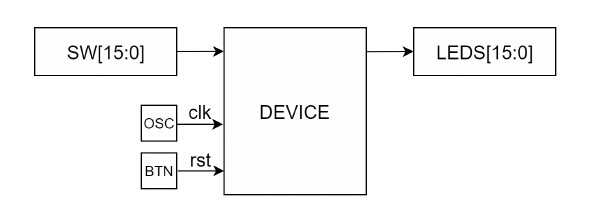

# Лабораторная работа №3. Проектирование цифровых схем с использованием ПЛИС

## Описание лабораторной работы

### Цель работы

Получить навыки разработки цифровых устройств на базе программируемых логических интегральных схем (ПЛИС).

### Указания к выполнению работы

Работа выполняется в Vivado Design Suite и с использованием отладочной платы Nexys 4 DDR (новое название Nexys A7).

### Порядок выполнения работы

1. Доработайте схему функционального блока, разработанного в лабораторной работе №2, в соответствии с рисунком. Необходимо добавить возможность работы с блоком посредством дискретных портов ввода/вывода, подключенных к переключателям, светодиодам и кнопкам платы Nexys 4 DDR:

  * значения операндов должны вводиться с помощью переключателей (SW);
  * результат должен выводиться на светодиоды (LEDS);
  * с целью повышения удобства работы пользователя допускается использование дополнительных кнопок, переключателей и светодиодов;
  * интерфейс пользователя должен обеспечивать возможность многократного проведения вычислений без постоянного нажатия на кнопку сброса.

3. Разработайте тестовое окружение и проведите моделирование.
4. Проведите синтез и размещение схемы для ПЛИС XC7A100T-1CSG324C, входящей в состав отладочной платы Nexys 4 DDR.
5. Определите количество и тип используемых ресурсов ПЛИС после размещения схемы.
6. Проверьте работоспособность схемы на отладочной плате Nexys 4 DDR.
7. Составьте отчет по результатам выполнения работы.

### Схема сопряжения функционального блока с дискретными портами ввода/вывода и источником сихросигнала

