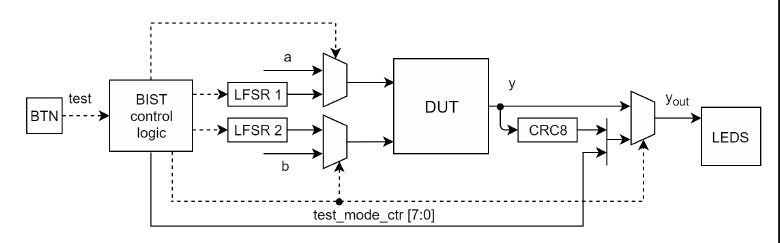

# Лабораторная работа №4. Проектирование встроенных схем самотестирования

## Описание лабораторной работы

### Цель работы

Получить навыки разработки встроенных схем самотестирования (BIST, built-in self-test) для цифровых устройств, реализованных на базе программируемых логических интегральных схем (ПЛИС).

### Указания к выполнению работы

Лабораторная работа посвящена знакомству с особенностями разработки встроенных схем самотестирования для цифровых устройств, реализованных на базе микросхем ПЛИС. Работа выполняется в Vivado Design Suite и с использованием отладочной платы Nexys 4 DDR (новое название Nexys A7).

### Порядок выполнения работы

  1. Доработайте схему функционального блока, разработанного в лабораторной работе №3, в соответствии с рисунком 4.1. На рисунке данный блок обозначен как DUT (Design under Test). Необходимо добавить в схему возможность выполнять самотестирование по внешней команде – по факту нажатия кнопки. Схема самотестирования должна удовлетворять следующим требованиям.

     - Вход и выход из режима самотестирования должен выполняться по факту нажатия кнопки BTN.
     
      - Модуль «BIST control logic» должен управлять коммутацией сигналов в режиме тестирования. Данный модуль также должен хранить количество переходов в режим самотестирования с момента подачи питания на схему.
    
      - Должна быть поддержана возможность подавать вместо операндов функции значения с регистров сдвига с линейной обратной связью LFSR (Linear-Feedback Shift Register). Регистры LFSR будут выполнять функции генераторов псевдослучайных чисел. Полиномы, на базе которых работают регистры LFSR, определяются в варианте задания.
    
      - Значение выхода функционального блока (DUT) в режиме тестирования должно проходить через модуль расчета циклического избыточного 8-битного кода CRC8 (Cyclic Redundancy Check). По значению CRC8 в конце тестирования определяется корректность работы схемы. Использование такого подхода позволяет сэкономить память для записи истории тестирования и для списка эталонных значений на каждой итерации тестирования. Полином для CRC8 определяется в варианте задания.
    
      - Результат работы блока в режиме самотестирования должен представлять собой значение кода CRC8 после 256 итераций тестирования. Одной итерацией тестирования называется расчет результата на одной комбинации входных операндов.
    
      - В режиме тестирования на светодиоды должно выводиться значение CRC8 и количество переходов схемы в режим самотестирования с момента подачи питания на схему. В режиме нормальной работы на светодиоды выводится результат расчета функционального блока (DUT).
    
  3. Разработайте тестовое окружение и проведите моделирование схемы. Определите корректное значение CRC8 в конце процесса самотестирования, то есть после 256 итераций смены входных операндов.
  4. Проведите синтез и размещение схемы для ПЛИС XC7A100T-1CSG324C, входящей в состав отладочной платы Nexys 4 DDR.
  5. Определите количество и тип используемых ресурсов ПЛИС после размещения схемы.
  6. Проверьте работоспособность схемы на отладочной плате Nexys 4 DDR в нормальном режиме и в режиме самотестирования.
  7. Составьте отчет по результатам выполнения работы.

### Схема сопряжения функционального блока со схемой тестирования

